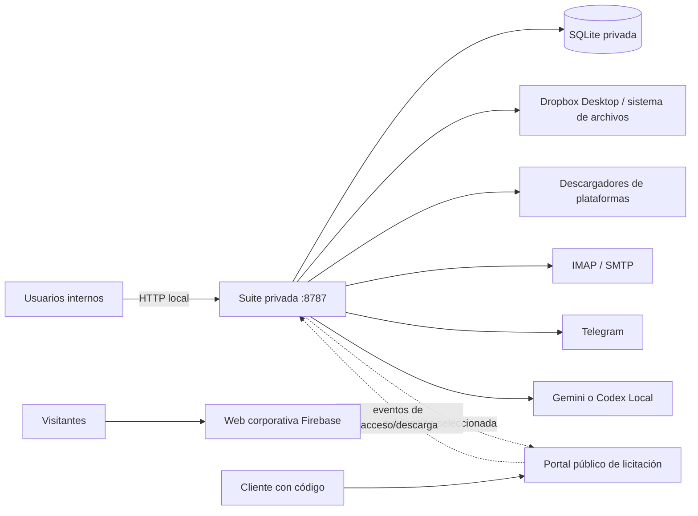
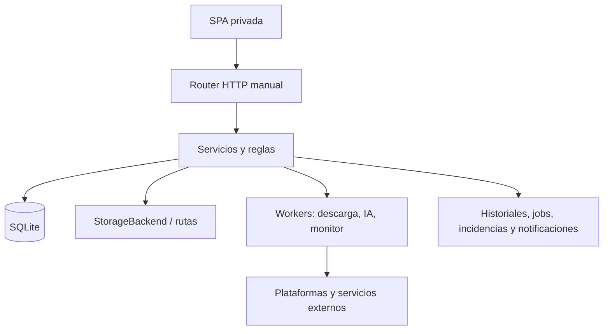

# Arquitectura técnica real

## Límites del sistema

La línea discontinua del portal representa una implantación B no consolidada. Firebase no sirve la SPA privada ni comparte su SQLite.

## Aplicación privada

- Raíz: `webapp/infonalia_webapp`.
- Backend: Python estándar sobre `BaseHTTPRequestHandler` y `ThreadingHTTPServer`; no es Flask ni Django.
- Entrada principal: `app.py`, con más de 10.000 líneas y routing manual.
- Frontend: SPA de HTML/CSS/JavaScript sin framework, servida por el mismo proceso.
- Escucha prevista: `127.0.0.1:8787`.
- Persistencia real: `data/infonalia.db`; snapshot seguro e inspección de solo lectura efectuados el 12/09/2026, con integridad correcta y migración 0036 aplicada.
- Migraciones: `db_migrations.py`, versiones `0001` a `0036`.
- Módulos extraídos: `ai/`, `agenda/`, `monitor/`, almacenamiento, automatización, importación, seguridad, clientes/envíos, comentarios y justificaciones.

## Capas conceptuales

No todas las reglas están fuera de `app.py`; esta es la separación conceptual, no una arquitectura de paquetes perfecta.

## Familias de API

| Familia | Finalidad |
| --- | --- |
| `/api/me`, `/api/health` | Sesión y vida mínima del proceso. |
| `/api/admin/operational-health` | Contrato, salud funcional y excepciones; solo admin y solo lectura. |
| `/api/dias`, `/api/infonalia/history` | Días, revisión e historial de importación. |
| `/api/licitaciones`, `/capture`, `/search` | CRUD, captura, centro y detalle. |
| `/api/import/*` | CSV, MSG y ejecución manual del importador Infonalia. |
| `/api/licitaciones/*/descargar` | Descarga en cola y metadatos. |
| `/api/tender-monitor*`, `/api/monitor/*` | Monitor actual y superficies legacy/auxiliares. |
| `/api/licitaciones/*/ai-summary`, `/api/ai/*` | Resúmenes, cola y workers IA. |
| `/api/agenda*`, `/api/actuaciones*` | Calendario, pendientes y actuaciones. |
| `/api/comments*` | Comentarios unificados. |
| `/api/clientes*`, `/api/cliente-envios*` | Clientes, envíos y borradores. |
| `/api/justificaciones-baja*` | Módulo dormante conservado. |
| `/api/config*`, `/api/admin/*` | Configuración, usuarios, Telegram y automatización. |
| `/api/storage/*` | Estado, pruebas no destructivas y marcadores. |
| `/api/news*` | Noticias en Markdown seguro. |
| `/api/portal-publications*` | Portal experimental no consolidado. |

## Frontend y navegación

La SPA consolidada usa vistas por módulos. El árbol local añade rutas profundas bajo `/app/...` para colecciones y objetos de Agenda, Infonalia, licitaciones, actuaciones, clientes, envíos, buzón, monitor, automatizaciones y configuración. El login conserva únicamente destinos internos que empiezan por `/app`, evitando redirecciones abiertas. Estos cambios son B hasta su consolidación.

La interfaz móvil es responsive dentro de la misma SPA: cajón de navegación, controles con tamaño táctil, tarjetas para tablas/vistas densas y prevención de cortes horizontales. No existe cliente móvil nativo ni API pública para una app móvil.

## Procesos auxiliares

- Worker de descargas: ejecuta el descargador canónico y registra `download_jobs`.
- Worker IA: reclama jobs, prepara un workspace aislado, invoca proveedor, valida y persiste.
- Scheduler/orquestador: corre dentro de la aplicación y reclama ejecuciones de forma idempotente.
- Monitor: usa leases y ciclos; una licitación fallida no debe detener las demás.
- Scripts Windows: arrancar/reiniciar app, keeper/wake, Ficha y portal local. No se ejecutaron.

## Almacenamiento

`LocalStorage` y las rutas físicas sincronizadas por Dropbox Desktop son la vía operativa. `ruta_carpeta` debe ser relativa a la raíz configurada cuando pertenece al árbol Dropbox. Los marcadores `{id}.llangon` identifican carpetas; `EnSeguimiento.llangon` expresa seguimiento. El adaptador Dropbox API es incremental, no destructivo y no sustituye esa autoridad física.

## Superficies públicas

### Web corporativa

`firebase/public_firebase` contiene una SPA estática, con configuración Firebase en la raíz. No depende de la SQLite privada y actualmente presenta noticias vacías de forma honesta.

### Portal de licitaciones en desarrollo

Hay dos arquitecturas en el árbol local:

1. `public_portal_server`: Python/SQLite/archivos en `127.0.0.1:8790`, previsto para exposición exclusiva mediante túnel. Recibe publicaciones por API administrativa y devuelve eventos.
2. `cloudflare/licitaciones_portal`: Next 16, React 19, Vinext/Sites, D1 para metadatos y R2 para ficheros.

Ambas aíslan al cliente de la app privada y emplean código por publicación. **⚠️ PENDIENTE DE VERIFICACIÓN:** arquitectura pública elegida y despliegue real.

## Contrato y observabilidad

- `system_contract.py` deriva migración vigente, tablas esenciales, roles, estados y plataformas desde fuentes de código canónicas.
- `operational_health.py` abre SQLite con `mode=ro` y `query_only`, comprueba integridad, contrato, colas, backups, scheduler e integraciones sin conexiones externas.
- El frontend reutiliza la vista **Automatizaciones** como dashboard de excepciones; Agenda conserva trabajo y vencimientos.
- KeeperTick se valida mediante la ejecución real de la tarea Windows. La tabla `monitor_scheduler_heartbeat` pertenece al scheduler anterior y no es evidencia primaria del orquestador único.

## Configuración

La precedencia operativa habitual es configuración guardada en la Suite, después variables de entorno y finalmente valores por defecto. Las credenciales son de solo escritura en las respuestas públicas. Esta documentación no enumera ni copia valores sensibles.
