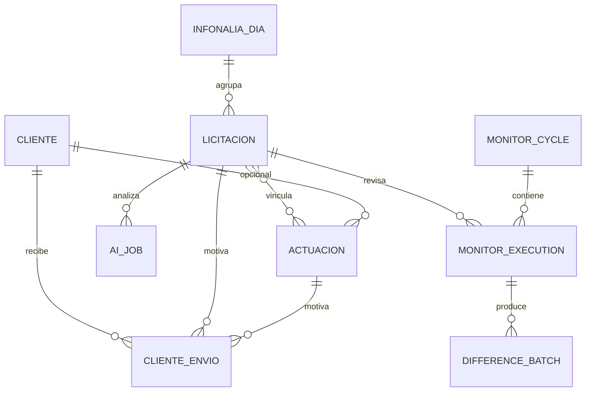

# Base de datos y modelo de datos

## Autoridad y migraciones

La aplicación privada usa SQLite. El esquema consolidado se crea y evoluciona mediante `schema_migrations` y 36 migraciones versionadas. No debe editarse una base real para “ponerla al día” manualmente; el arranque ejecuta migraciones idempotentes.

| Rango | Evolución principal |
| --- | --- |
| 0001–0003 | Esquema base, jobs de descarga e historial de importación. |
| 0004–0010 | Actuaciones, multivínculo, Agenda, almacenamiento, centro, estados y marcadores. |
| 0011–0012 | Monitor inicial e inventario/reconciliación. |
| 0013–0016 | IA, descarte de jobs, progreso y avisos. |
| 0017–0025 | Comentarios, acciones por correo, importador IMAP, metadatos y Telegram. |
| 0026–0034 | Orquestador, clientes/envíos, publicación, justificaciones, actividad y claims. |
| 0035–0036 | Monitor e2e y autoridad de baseline. |

El portal experimental crea `portal_publications` y `portal_events` por código directo. Falta una migración numerada: estado B.

## Inventario de entidades

### Núcleo

- `infonalia_dias`: lote diario y ciclo de revisión.
- `licitaciones`: entidad central, estado, fechas, origen, publicación, carpeta y datos de contratación.
- `licitacion_historial`: cambios auditables.
- `notificaciones`, `usuarios`, `app_settings`, `noticias`.
- `schema_migrations`.

### Trabajo y agenda

- `actuaciones`, `actuacion_licitaciones`, `actuacion_historial`.
- `agenda_eventos`.
- `comments`.
- La tabla antigua `licitacion_actuaciones` queda como legado de la primera versión.

### Importación, descarga y archivos

- `download_jobs`.
- `import_runs`, `import_results`.
- `infonalia_email_imports`, `infonalia_email_blocks`, `infonalia_email_incidents`, `infonalia_email_import_claims`.
- `infonalia_activity_events`.
- `storage_uploads`.
- `licitacion_seguimiento_novedades` y tablas de reconciliación heredadas.

### IA y comunicaciones

- `ai_analysis_jobs`, `ai_summaries`, `ai_usage_log`, `ai_analysis_notifications`.
- `email_action_codes`, `email_action_events`, `email_ai_summary_requests`.

### Clientes

- `clientes` con baja lógica.
- `cliente_envios`, `cliente_envio_adjuntos`, `cliente_envio_eventos`.

### Justificaciones dormantes

- `justificaciones_baja`, versiones, documentos, activos e historial.

### Automatización y monitor

- `automation_tasks`, `automation_runs`, `automation_locks`.
- Tablas legacy: `monitor_runs`, reconciliación de rutas, alertas, claims y heartbeat.
- Monitor e2e: ciclos, ejecuciones, snapshots, baselines, lotes, diferencias, enlaces IA, notificaciones, incidencias, informes, leases, settings y destinatarios.

## Relaciones conceptuales

El diagrama resume cardinalidades funcionales; no garantiza que todas las claves foráneas estén declaradas físicamente en cada tabla histórica.

## Estados canónicos

### Licitación

`Importada` → `Enviada a Nuria` → decisión `Descartada`, `Descargar para ver` o `Preparar ficha`; después puede pasar a `Preparada` y `Oferta enviada`. Son siete estados oficiales. Alias antiguos se normalizan; no deben reintroducirse como estados nuevos.

### Actuación

- Abiertos: `pendiente`, `en_preparacion`, `preparado`.
- Cerrados: `enviado`, `cancelado`.
- Clasificación visual: `sin_fecha`, `vencida`, `vence_hoy`, `vence_esta_semana`, `cerrada_fuera_de_plazo`.

Tipos: requerimiento, subsanación, aclaración, documentación adicional, justificación de baja, garantía definitiva, firma de contrato, presentación de oferta, visita técnica, apertura de mesa, consulta al órgano, recurso/alegaciones, revisión interna, comunicación cliente, seguimiento y otro.

### Agenda

Abiertos: `pendiente`, `en_curso`, `preparado`, `preparada`. Cerrados: variantes normalizadas de cerrado, enviado y cancelado.

### Envío a cliente

`en_preparacion`, `listo_para_preparar_correo`, `correo_outlook_generado`, `enviado`, `incidencia`, `cancelado`.

### IA

Jobs activos: `pending`, `processing`, `deferred`; además completado, error, cancelado o atascado según la fase. Los resúmenes guardan `quality_status`; un JSON vacío o de baja calidad no se acepta.

### Automatización y monitor

Automatización: `running`, `completed`, `failed`, `skipped`, `interrupted`.  
Monitor: `baseline_rebuilt`, `no_changes`, `notified`, `partial`, `no_recipients`, `not_prepared`, `completed_with_incidents`, `failed`.

### Justificación de baja

`Borrador`, `Enviado al cliente`, `Final`; se conserva solo para el módulo dormante.

## Autoridades fuera de SQLite

- `{id}.llangon`: identidad física de carpeta.
- `EnSeguimiento.llangon`: única autoridad para decidir seguimiento.
- `tender_monitor_baselines`: autoridad de comparación, aunque reside en SQLite.
- `.llangon-monitor/technical_snapshot.json`: caché diagnóstica; nunca autoridad.
- Estados ocultos de descargadores: inventario técnico por plataforma.
- Ficheros Excel/PDF de Ficha: artefactos locales, no sincronizados de vuelta a SQLite.

## Integridad y legado

- SQLite debe operar con claves foráneas activadas.
- Jobs, imports, acciones de correo, monitor y eventos usan claves/claims para idempotencia.
- Las respuestas parciales de plataformas no deben confirmar retiradas.
- No se inspeccionó integridad ni contenido de la base real por prohibición expresa.
- Verificación local del 12/09/2026: 0036 aplicada; dos usuarios activos, ambos PBKDF2-SHA256; cero registros con contraseña legacy.

## Contrato verificado y lectura segura

`system_contract.py` comprueba automáticamente las tablas esenciales, todas las versiones de `MIGRATIONS` y los roles existentes. `operational_health.py` usa URI SQLite `mode=ro`, `PRAGMA query_only=ON` y `quick_check(1)`; no llama a `run_migrations` ni a ningún `ensure_*_schema`.

En el snapshot seguro del 12/09/2026:

- `integrity_check=ok`;
- última migración `0036_tender_monitor_baseline_ownership`;
- contrato esencial completo;
- no se encontró ningún rol distinto de `admin`/`nuria`;
- existe un `download_jobs` histórico en `running` desde el 21/07/2026 (`id=53`), conservado sin alteración para revisión operativa.
