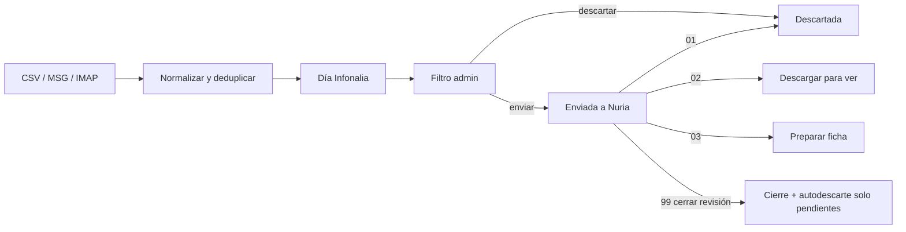
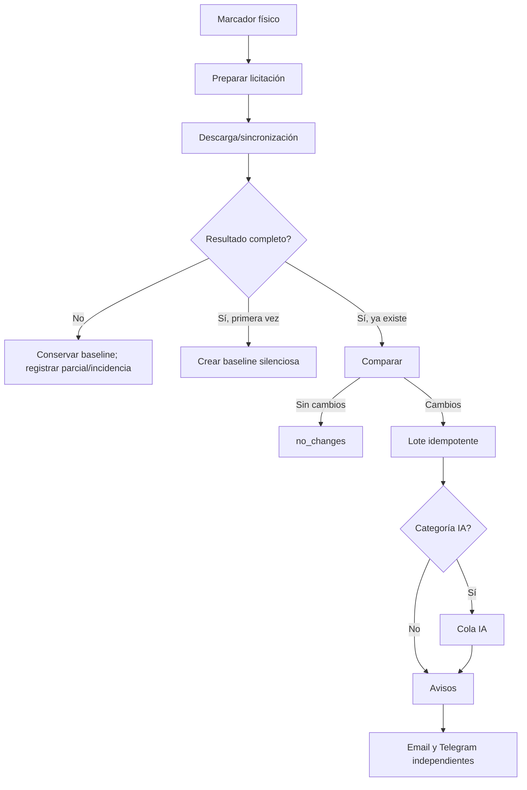

# Módulos y flujos funcionales

## 1. Infonalia, importación y revisión

Entradas admitidas: CSV, MSG y buzón IMAP estructurado. La importación normaliza campos, deduplica, agrupa en `infonalia_dias` y crea licitaciones en `Importada`. El historial conserva importaciones, bloques e incidencias.

Un día no se reabre por cambios ordinarios posteriores; existe una acción explícita para desmarcarlo. Los anuncios previos tienen opciones reducidas y no admiten acciones de descarga/preparación como si fueran licitaciones completas.

## 2. Acciones por correo

Los correos de respuesta usan asuntos `LLANGON_CMD` con códigos `01`, `02`, `03`, `04` y `99`. El procesador valida remitente permitido, código, entidad, relación con la revisión, estado e idempotencia. `04` solicita resumen IA solo si la función está habilitada. `99` cierra la revisión y autodescarta exclusivamente elementos aún sin decisión.

Una acción individual tardía puede aplicarse después del cierre si el estado sigue siendo elegible; queda auditada y genera alerta. Los estados avanzados no retroceden por correo. Las acciones que requieren descarga encolan el trabajo y no bloquean el ciclo IMAP.

## 3. Centro y detalle de licitaciones

El centro ofrece búsqueda, filtros por estado/fecha/plataforma, todos los expedientes y detalle. El detalle reúne campos, historial, documentos, actuaciones, comentarios, IA, monitor y acciones disponibles según rol. La captura manual conserva valores introducidos y detecta plataforma.

El árbol local añade URLs profundas de colección y objeto. Es B hasta consolidación.

## 4. Descargadores

La fuente única es `herramientas_python/Descargar_Licitacion.py` y sus módulos por plataforma. Los BAT/bridges delegan; no deben contener una implementación paralela.

| Plataforma | Documentos | Preguntas/respuestas | Observaciones |
| --- | --- | --- | --- |
| PLACE | Sí | Sí | Sesión/autenticación, identidad estable e historial. |
| Catalunya | Sí | Sí | Modelo neutral compartido y estado oculto propio. |
| Navarra | Sí | No | Q&A queda futuro, no implantado. |
| Euskadi | Sí | No | Inventario estructurado e idempotencia. |
| Madrid | Sí | No | Adaptador específico. |
| Junta de Andalucía | Sí | No | Adaptador específico con informe técnico. |
| Xunta de Galicia | Sí | No | Navegador controlado; recaptcha produce parcial. Sus PDF de preguntas son documentos ordinarios. |

Un inventario completo puede confirmar retiradas. Uno parcial conserva lo confirmado anteriormente. Cambios de URL wrapper no deben crear falsos documentos nuevos. Los ficheros ya descargados se reutilizan; versiones modificadas conservan el histórico cuando el adaptador lo admite.

## 5. Preguntas y respuestas

PLACE y Catalunya transforman preguntas a un contrato neutral con identidad estable, orden, versiones, respuesta y retirada/restauración. El DOCX generado es un artefacto derivado, no un documento oficial, no entra en la baseline documental y nunca se envía a IA por el monitor. Borrar manualmente el DOCX no borra el estado técnico.

## 6. Monitor de licitaciones

Una licitación se sigue solo si su carpeta contiene `EnSeguimiento.llangon`. El ciclo obtiene un lease compartido, ejecuta el descargador canónico, construye snapshot semántico y compara contra `tender_monitor_baselines`.

Categorías IA configurables por defecto: acta, resolución, informe, requerimiento, adjudicación y exclusión. Las preguntas jamás pasan por IA. Varias novedades de una licitación/ciclo forman un lote y un aviso. Fallos de IA, email o Telegram no deben impedir los demás canales. Las incidencias del ciclo se consolidan.

## 7. IA de licitaciones

Proveedores posibles: `gemini`, `codex_local` o `disabled`. La selección documental prioriza PDF útiles, limita número/tamaño, excluye históricos, adjudicaciones previas, Ficha de cliente y Q&A. El hash del conjunto evita duplicados.

La cola permite encolar, iniciar, cancelar, descartar visualmente, detectar jobs atascados y reintentar diferidos. Gemini respeta límites por minuto/día y cooldown 429; admite texto extraído, PDF inline o automático. Codex Local trabaja en copia aislada, con sandbox configurado, sin modificar originales. La salida debe ser JSON válido, coherente y con calidad suficiente; después se postprocesa para eliminar recomendaciones impropias. El resumen puede verse, guardarse como PDF y enviarse por correo.

## 8. Agenda

Unifica licitaciones en estados operativos (`Descargar para ver`, `Preparar ficha`, `Preparada`), actuaciones abiertas, eventos internos y envíos a clientes. Ofrece hoy/semana/mes, vencidos, sin fecha, banco de trabajo y resumen por correo. La agenda diaria automatizada está definida a las 08:00 en días laborables.

## 9. Actuaciones

Una actuación puede existir sin licitación, vincular una o varias licitaciones y opcionalmente un cliente. Tiene tipo, responsable, plazo, estado, prioridad, descripción, historial y cierre/cancelación. Los borrados de día o licitación respetan actuaciones abiertas; una relación con actuación cerrada puede desvincularse sin borrar la actuación.

## 10. Comentarios

Comentarios unificados sobre licitación, actuación, evento de Agenda o día Infonalia. Admiten visibilidad `internal` o `team`, fijado, autor, edición/borrado conforme a permisos y listado reciente. No existe todavía un canal bidireccional de comentarios de clientes.

## 11. Clientes y envíos

Clientes conserva datos fiscales y operativos y usa baja lógica. Un envío puede relacionarse con cliente, licitación y actuación; incorpora tipo, estado, carpeta, adjuntos y eventos. El usuario selecciona una carpeta permitida, genera un borrador Outlook `.msg` si COM está disponible o `.eml` seguro como alternativa, lo abre y finalmente marca el envío manualmente. La Suite no envía el correo al cliente de forma automática.

Tipos de envío: ficha inicial, plantilla de oferta, documentación para revisión/firma, requerimiento, subsanación, aclaración, documentación adicional, contrato de encargo, recordatorio y otro.

## 12. Justificaciones de baja

El código implementa cálculo decimal determinista para un lote, versiones, pegado/importación, validación, Word/Excel, documentos e historial. Admin puede mutar y Nuria consultar/descargar. No usa IA ni consultas automáticas a fuentes externas. La interfaz fue desconectada por decisión posterior: E, código dormante.

## 13. Noticias

CRUD, Markdown seguro y HTML sanitizado existen. La navegación privada está oculta y la web pública no publica noticias reales. No hay un flujo público dinámico activo confirmado: B.

## 14. Administración

Admin gestiona usuarios, ajustes, pruebas SMTP/Telegram, almacenamiento, automatizaciones, monitor, importaciones manuales y diagnósticos. La vista Automatizaciones comienza con un dashboard de excepciones que resume contrato, SQLite, backups, scheduler, tareas, colas, monitor e integraciones. El diagnóstico es solo lectura y no lanza pruebas externas. Nuria tiene acceso de revisión y operación limitada, sin mutaciones administrativas.

## 15. Ficha Llangon

Herramienta Excel local desacoplada. Lee clientes de SQLite en modo estrictamente lectura solo al pulsar “Actualizar clientes”; conserva la última caché válida si falla. Importa datos PLACE, edita contenido y genera PDF canónico mediante bridge/ReportLab, con fallback de impresión Excel. Versión técnica actual: plantilla 2.1.0, payload 1.1, bridge 1.4.0. Está en archivos no versionados: B.

No existe escritura Excel→SQLite, actualización automática al abrir, sincronización bidireccional ni endpoint web dedicado.

## 16. Portal público por licitación

El flujo local selecciona exactamente una `Ficha.pdf` y descargas adicionales, genera un modelo de páginas, exige cobertura y revisión, guarda borrador, publica con código individual, permite rotación y sincroniza accesos/descargas. La IA enriquece, pero no puede omitir páginas: los contenidos no mapeados deben conservarse literalmente.

Hay dos destinos técnicos en desarrollo (servidor local+túnel y Cloudflare D1/R2). Ambos son B y no se consideran producción.

## 17. Funciones no existentes

- Módulo autónomo de adjudicaciones.
- Contabilidad o facturación.
- Portal cliente general con usuarios y conversaciones bidireccionales.
- Integración Trello/Noloco/ClickUp/Notion/Softr.
- Auditoría diaria 360 implantada.

## 18. Navegación, paneles y móvil

La Suite usa una sola SPA para escritorio y móvil. En pantallas pequeñas activa cajón lateral, controles compactos pero táctiles y representaciones en tarjeta para cola IA, historial, monitor y salud operativa. Los paneles de administración se separan de las vistas de Nuria. Agenda muestra trabajo/vencimientos; el dashboard administrativo muestra excepciones técnicas. Las búsquedas principales se ejecutan al confirmar, evitando peticiones en cada pulsación. El router profundo local mejora enlaces nativos, pero sigue B; la capacidad responsive base es A.
